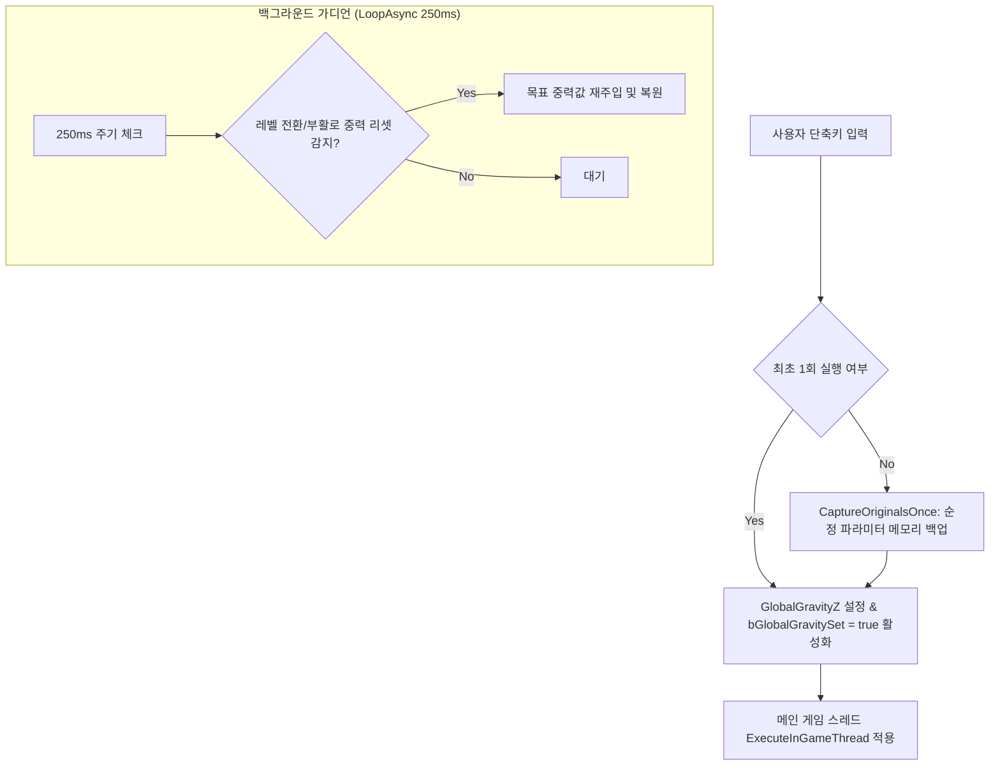
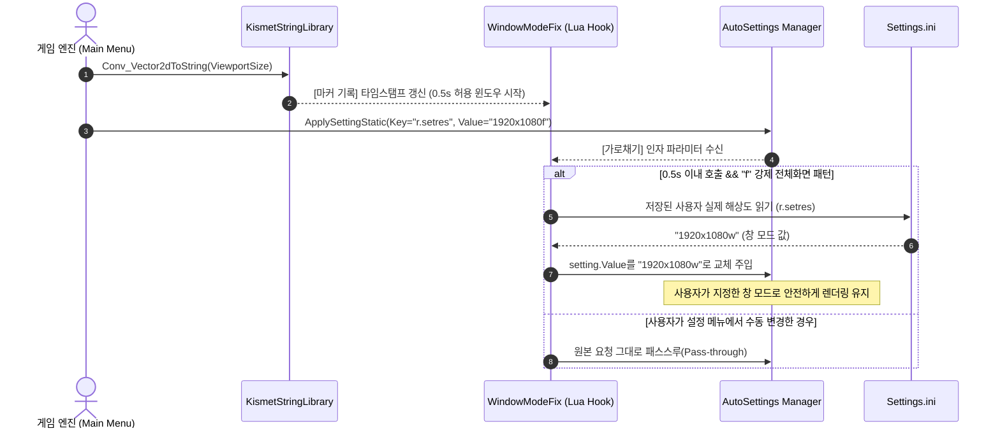
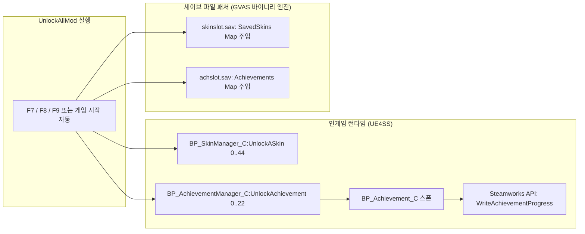

<div align="center">

# 🎮 HANS UE4SS Mod Collection

**Steam 인디 정밀 플랫포amer 게임 [HANS](https://store.steampowered.com/app/2616420/HANS/)를 위한 고성능 UE4SS Lua 모드 패키지**

[-1b2838?style=for-the-badge&logo=steam&logoColor=white)](https://store.steampowered.com/app/2616420/HANS/)
[](https://steamdb.info/app/2616420/)
[](https://www.unrealengine.com/)
[](https://github.com/UE4SS-RE/RE-UE4SS)
[](https://www.lua.org/)

<br/>

[모드 구성](#-모드-상세-구성) • [빠른 시작](#-빠른-시작-원클릭-배치-스크립트) • [기술 아키텍처](#-기술-아키텍처--동작-원리) • [디렉토리 구조](#-디렉토리-구조) • [트러블슈팅](#-트러블슈팅--faq)

---

</div>

## 📖 개요 (Overview)

본 저장소는 극한의 난이도를 자랑하는 물리 점프 액션 게임 **HANS**에서 플레이어 편의성을 극대화하고 게임 자체의 엔진 결함을 교정하며, 모든 콘텐츠를 즉시 즐길 수 있도록 개발된 **UE4SS(Unreal Engine 4/5 Scripting System)** 기반의 Lua 모드 모음집입니다.

* 🕹️ **GravityMod:** 맵 이동 및 리스폰 시에도 풀리지 않는 실시간 중력 제어기 (무중력, 달 중력, 공중 부유 등)
* 🖥️ **WindowModeFix:** 타이틀 및 메인 메뉴 진입 시 창 모드가 강제로 전체화면으로 초기화되는 버그의 무간섭 자동 교정기
* 🏆 **UnlockAllMod:** 45종 모든 수박 스킨 및 23종 모든 업적(실제 Steam 도전과제 연동 포함) 실시간/오프라인 올인원 해금기
* ⚡ **Hot-Sync 배포 자동화:** NTFS Directory Junction을 활용하여 파일 복사 없이 코드 수정이 게임에 즉각 반영되는 원클릭 관리 스크립트 제공

---

## 📦 모드 상세 구성

### 1. 🌌 GravityMod (실시간 중력 & 물리 제어 모드)
> **모듈 경로:** [`GravityMod/`](file:///h:/ue4ss%20mod%20test/hans%20mods%20test/GravityMod) | **상세 문서:** [`GravityMod/README.md`](file:///h:/ue4ss%20mod%20test/hans%20mods%20test/GravityMod/README.md)

플레이어 캐릭터의 중력과 운동 에너지를 실시간으로 제어합니다.  
언리얼 엔진 특성상 레벨이 변경되거나 체크포인트에서 부활할 때 `WorldSettings` 액터가 재생성되며 중력이 원복되는 현상을 **250ms 비동기 가디언 루프(`LoopAsync`)**를 통해 완전 방어합니다.

#### 🎮 조작 단축키 매핑 테이블
| 단축키 | 넘패드 | 프리셋 이름 | 중력 배율 | GravityZ 수치 | 동작 및 물리 메커니즘 |
| :---: | :---: | :--- | :---: | :---: | :--- |
| **`F1`** | **`Num 1`** | **원래 상태 (Original)** | `1.0x` | `-980.0` | 백업해둔 순정 게임의 글로벌 중력 및 물리 상태로 100% 원상 복구 |
| **`F2`** | **`Num 2`** | **저중력 (Low)** | `0.25x` | `-245.0` | 완만한 낙하 속도 및 긴 체공 시간 제공 (점프 난이도 완화) |
| **`F3`** | **`Num 3`** | **달 중력 (Moon)** | `0.08x` | `-78.4` | 달 표면 수준의 초저중력으로 장거리 도약 구간 공략 |
| **`F4`** | **`Num 4`** | **완전 무중력 (Zero)** | `0.0x` | `0.0` | 수직 낙하 속도를 즉시 `0`으로 리셋하여 공중에 완전 정지 |
| **`F5`** | **`Num 5`** | **공중 부유 (Floating)** | `0.05x` | `-49.0` | 위쪽으로 `750` 상승 임펄스를 부여한 뒤 부드럽게 글라이딩 |
| **`↑`** | - | **상승 추진 (Thrust)** | - | - | 무중력(0.0x) 또는 초저중력(0.1x 이하) 상태에서 위쪽으로 `400` 추진력 부여 |
| **`F6`** | - | **상태 진단 (Status)** | - | - | 콘솔창에 현재 중력, `GravityScale`, `Effective Gravity`, `JumpZVelocity` 출력 |

---

### 2. 🪟 WindowModeFix (창 모드 강제 전체화면 버그 픽스)
> **모듈 경로:** [`WindowModeFix/`](file:///h:/ue4ss%20mod%20test/hans%20mods%20test/WindowModeFix) | **상세 문서:** [`WindowModeFix/README.md`](file:///h:/ue4ss%20mod%20test/hans%20mods%20test/WindowModeFix/README.md)

HANS의 내장 블루프린트(`WBP_MainMenuUI`)는 메인 메뉴에 진입할 때마다 현재 해상도 뒤에 강제로 `f`를 덧붙여 전체화면을 강제 적용하는 결함이 있습니다.  
이 모드는 Kismet String 변환 함수와 설정 적용 함수의 호출 간격을 감지하는 **타이밍 마커 윈도우(0.5초)** 후킹 기법으로 버그 호출만을 정밀 가로채 플레이어가 저장한 실제 창 모드(`Settings.ini`)로 즉각 대체합니다.

* **동작 방식:** 별도의 키 조작 없이 백그라운드에서 100% 전자동 무간섭 동작.
* **설정 완벽 보존:** 옵션 메뉴에서 설정한 창 모드(`w`), 테두리 없는 창 모드(`wf`)가 영구히 유지됩니다.

---

### 3. 🏆 UnlockAllMod (모든 스킨 & 업적 전자동 해금기)
> **모듈 경로:** [`UnlockAllMod/`](file:///h:/ue4ss%20mod%20test/hans%20mods%20test/UnlockAllMod) | **상세 문서:** [`UnlockAllMod/README.md`](file:///h:/ue4ss%20mod%20test/hans%20mods%20test/UnlockAllMod/README.md)

**키 입력 없이 게임이 실행되면 즉시** 게임 내 숨겨진 **45종 모든 수박 스킨**과 **23종 모든 업적(실제 Steam 도전과제 팝업 트리거 연동)**이 100% 자동 해금됩니다.

* ⚡ **완전 자동화 & 스팸 방지 (Zero-Keypress & Anti-Spam):** 모드 로드 즉시 세이브 파일을 선제 패치하고, 백그라운드 가디언 루프(`LoopAsync`)가 매니저 액터 스폰을 감지하여 1회 정밀 자동 해금 후 루프를 즉시 종료(`return true`)하므로 **로그 스팸이 100% 방지**됩니다.
* 🏆 **Steam 도전과제 100% 보장:** 인게임 호출과 더불어 네이티브 Steamworks API(`steam_api64.dll`) 브릿지를 통해 **실제 Steam 도전과제 22종이 즉시 달성**됩니다.
* 🎮 **이중 안전장치(Dual Guarantee):** 인게임 런타임 액터 UFunction 호출과 디스크 GVAS 바이너리 세이브 파일(`skinslot.sav`, `achslot.sav`) 직접 패치가 동시에 동작하여 메인 메뉴 및 인게임 모두 완벽 적용됩니다.
* 🚀 **원클릭 자동 실행:** `2_게임실행.bat`를 실행하면 게임 구동 직전 자동으로 세이브 패치가 선행 실행됩니다.
* 🕹️ **비상 수동 단축키 (선택 사항):**
  * **`F7` / `Num 7`**: 모든 45종 스킨 수동 재해금
  * **`F8` / `Num 8`**: 모든 23종 업적 수동 재해금 & Steam 도전과제 재전송
  * **`F9` / `Num 9`**: 스킨 + 업적 올인원 수동 전체 재해금

---

## 🔬 기술 아키텍처 & 동작 원리

### 1. 언리얼 엔진 중력 계산 파이프라인
언리얼 엔진의 `CharacterMovementComponent`는 다음과 같은 계층 구조로 캐릭터 최종 중력을 산출합니다:

$$\text{Player Gravity} = \text{WorldSettings:GetGravityZ()} \times \text{CharacterMovement.GravityScale}$$

단순히 `WorldSettings.WorldGravityZ` 프로퍼티만 변경할 경우 엔진이 내부적으로 `bGlobalGravitySet`이 꺼져 있으면 프로젝트 디폴트값으로 재계산하여 값이 풀리는 현상이 발생합니다.



### 2. 창 모드 버그 픽스 후킹 메커니즘


### 3. 모든 스킨 및 업적 해금 메커니즘


---

## 🚀 빠른 시작 (원클릭 배치 스크립트)

복잡한 수동 복사 과정 없이 번호 순서대로 더블 클릭하여 즉시 적용할 수 있습니다:

| 번호 | 실행 파일 | 설명 | 내부 실행 메커니즘 |
| :---: | :--- | :--- | :--- |
| **`1`** | **`1_모드연결_및_활성화.bat`** | **모드 연결 및 활성화** | 게임 UE4SS `Mods` 폴더에 NTFS Junction을 연결하고 `mods.txt`에 3개 모드 자동 등록 |
| **`2`** | **`2_게임실행.bat`** | **게임 바로 실행** | 로컬 설치 파일(`Hans.exe`) 또는 Steam URL 프로토콜(`steam://rungameid/2616420`)로 즉시 구동 |
| **`3`** | **`3_모드연결해제.bat`** | **모드 안전 제거** | 원본 프로젝트 파일은 그대로 보존하고 게임 폴더 내 링크 및 `mods.txt` 항목만 안전하게 제거 |
| **`4`** | **`4_스킨_업적_즉시해금.bat`** | **스킨 & 업적 즉시 해금** | 기존 세이브 백업 후 45개 스킨과 23개 업적을 즉시 주입 (오프라인/게임 미실행 상태 지원) |

> [!TIP]
> **Hot-Sync (무복사 실시간 개발) 환경이란?**  
> 본 프로젝트는 윈도우 파일 시스템의 **NTFS Directory Junction** 링크를 생성합니다.  
> 따라서 저장소의 `.lua` 파일을 수정하면 게임 폴더로 다시 복사할 필요 없이 게임 재시작(또는 UE4SS 모드 리로드)만으로 즉시 적용됩니다.

---

## 🛠️ 수동 설치 방법 (Manual Installation)

배치 파일을 사용하지 않고 수동으로 설치하고자 할 경우:

1. [UE4SS 공식 릴리즈](https://github.com/UE4SS-RE/RE-UE4SS/releases)에서 UE4SS를 다운로드하여 HANS 실행 바이너리 디렉터리에 설치합니다.
   * 설치 경로: `<HANS 설치 경로>\Hans\Binaries\Win64\`
2. 본 저장소의 `GravityMod`, `WindowModeFix`, `UnlockAllMod` 폴더를 아래 경로에 복사합니다:
   * `<HANS 설치 경로>\Hans\Binaries\Win64\ue4ss\Mods\`
3. `<HANS 설치 경로>\Hans\Binaries\Win64\ue4ss\Mods\mods.txt` 파일을 열고 다음 라인을 추가합니다:
   ```ini
   GravityMod : 1
   WindowModeFix : 1
   UnlockAllMod : 1
   ```
4. 게임을 실행합니다.

---

## 📁 디렉토리 구조

```text
hans-mods-test/
├── .gitignore                     # Git 제외 항목 정의 (로그, 캐시 등)
├── 1_모드연결_및_활성화.bat       # Junction 링크 생성 및 mods.txt 자동 등록
├── 2_게임실행.bat                # HANS 게임 원클릭 실행 스크립트
├── 3_모드연결해제.bat             # Junction 링크 해제 및 mods.txt 복원
├── 4_스킨_업적_즉시해금.bat       # 세이브 파일 즉시 해금 원클릭 배치 파일
├── setup_mod.ps1                 # 모드 연결 자동화 PowerShell 핵심 로직
├── unlink_mod.ps1                # 모드 연결 해제 PowerShell 핵심 로직
├── unlock_all.ps1                # 스킨 & 업적 세이브 바이너리 패처 PowerShell 스크립트
├── README.md                     # 프로젝트 메인 문서 (본 문서)
│
├── GravityMod/                   # [모듈 1] 실시간 중력 제어기
│   ├── enabled.txt               # 모드 활성화 플래그
│   ├── README.md                 # GravityMod 기술 세부 문서
│   └── scripts/
│       └── main.lua              # 중력 조작 및 가디언 루프 구현체
│
├── WindowModeFix/                # [모듈 2] 창 모드 버그 픽스
│   ├── enabled.txt               # 모드 활성화 플래그
│   ├── README.md                 # WindowModeFix 기술 세부 문서
│   └── scripts/
│       └── main.lua              # Kismet/AutoSettings 후킹 구현체
│
└── UnlockAllMod/                 # [모듈 3] 모든 스킨 & 업적 해금기
    ├── enabled.txt               # 모드 활성화 플래그
    ├── README.md                 # UnlockAllMod 기술 세부 문서
    └── scripts/
        └── main.lua              # 런타임 UFunction 호출 및 실시간 패치 로직
```

---

## 📋 시스템 요구 사항 및 기본 환경

* **운영체제:** Windows 10 / 11 (64-bit)
* **대상 게임:** [HANS (Steam)](https://store.steampowered.com/app/2616420/HANS/) (AppID: `2616420`)
* **필수 도구:** UE4SS (Unreal Engine 4/5 Scripting System v3.0 이상 권장)
* **기본 설치 경로:** `H:\steam\steamapps\common\HANS\Hans\Binaries\Win64\ue4ss\Mods`
* **설정 파일 위치:** `%LOCALAPPDATA%\Hans\Saved\Config\Windows\Settings.ini`
* **세이브 파일 위치:** `%LOCALAPPDATA%\Hans\Saved\SaveGames\` (`skinslot.sav`, `achslot.sav`)

---

## ❓ 트러블슈팅 & FAQ

**Q1. 단축키를 눌러도 중력이 변하지 않거나 반응이 없습니다.**
- UE4SS 콘솔 창이 정상적으로 뜨는지 확인하세요.
- `ue4ss/mods.txt` 파일에 `GravityMod : 1`이 기재되어 있는지 확인하세요.
- 게임 메인 메뉴가 아닌 인게임 맵에 캐릭터가 완전히 스폰된 상태에서 키를 입력해야 물리 컴포넌트가 바인딩됩니다.

**Q2. 창 모드가 여전히 전체화면으로 바뀝니다.**
- `%LOCALAPPDATA%\Hans\Saved\Config\Windows\Settings.ini` 파일이 읽기 전용으로 설정되어 있지 않은지 확인하세요.
- `Settings.ini` 내 `r.setres` 항목에 정상적인 해상도(예: `1920x1080w`)가 입력되어 있는지 확인하세요.

**Q3. 스킨이 메인 메뉴에서 바로 보이지 않습니다.**
- `4_스킨_업적_즉시해금.bat`를 실행한 후 게임을 재실행하거나, 인게임에서 `F7`을 누르세요.
- `%LOCALAPPDATA%\Hans\Saved\SaveGames\skinslot.sav`가 정상적으로 패치되었는지 확인하세요.

**Q4. Steam 업적이 즉시 달성되지 않습니다.**
- Steam 클라이언트가 로그인된 상태에서 게임을 실행 중이어야 합니다.
- 인게임에서 `F8` 키를 누르면 `BP_AchievementManager_C`를 통해 Steamworks에 즉시 업적 달성 신호가 전송됩니다.

**Q5. 모드를 완전히 제거하고 순정 상태로 되돌리고 싶습니다.**
- `3_모드연결해제.bat`를 실행하면 게임 폴더의 링크와 `mods.txt` 설정이 원상태로 깨끗이 복원됩니다.
