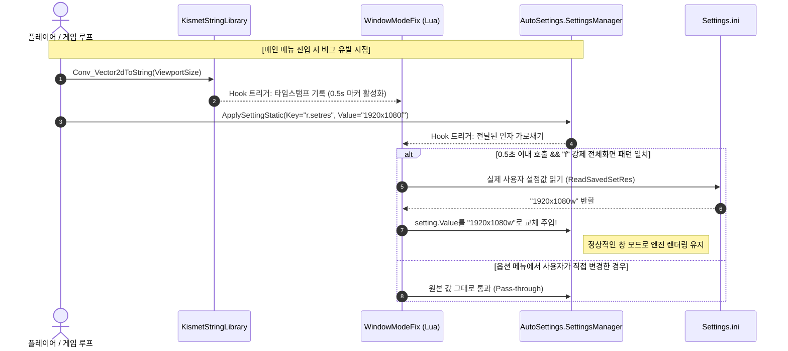

# WindowModeFix for HANS (UE4SS)

Steam 인디 플랫포머 게임 **HANS**에서 창 모드가 메인 메뉴 진입 시 강제로 전체화면으로 초기화되는 엔진/블루프린트 버그를 수정하는 픽스 모드입니다.  
UE4SS(Unreal Engine 4/5 Scripting System) 기반 무간섭(Zero-Interference) 후킹 방식으로 동작합니다.

---

## 🐛 게임 원본 버그 원인 분석

### 1. 설정 저장 파이프라인
* HANS 게임은 비디오 및 게임 설정을 관리하기 위해 언리얼 엔진 플러그인인 **AutoSettings**를 사용합니다.
* 사용자가 옵션 메뉴에서 창 모드를 선택하면 설정 파일에 다음과 같이 저장됩니다:
  * **저장 위치:** `%LOCALAPPDATA%\Hans\Saved\Config\Windows\Settings.ini`
  * **저장 형식:** `r.setres=<가로>x<세로><모드플래그>`
    * `w`: 일반 창 모드 (Windowed) — 예: `1920x1080w`
    * `wf`: 테두리 없는 전체 창 모드 (Borderless Fullscreen) — 예: `1920x1080wf`
    * `f`: 단독 전체화면 (Exclusive Fullscreen) — 예: `1920x1080f`

### 2. 버그 발생 시점
* 게임 타이틀 화면 또는 메인 메뉴 UI(`WBP_MainMenuUI`)가 로드될 때, 블루프린트 내부에서 현재 뷰포트 크기를 가져와 강제로 뒤에 문자열 **`"f"`**를 접미사로 붙입니다.
* 이후 `AutoSettings.SettingsManager:ApplySettingStatic` 함수를 호출하여 무조건 전체화면(`r.setres=1920x1080f`)으로 덮어써버립니다.
* 이로 인해 사용자가 창 모드를 저장했더라도 타이틀 화면에 진입하거나 메인 메뉴로 돌아갈 때마다 무조건 전체화면으로 튕겨 나가는 불편함이 존재합니다.

---

## 🛠️ 솔루션 메커니즘 (타이밍 마커 윈도우 후킹)

사용자가 게임 내 옵션 메뉴에서 해상도나 화면 모드를 정상적으로 변경할 때는 모드가 개입하지 않아야 하며, **메인 메뉴가 버그로 강제 호출할 때만 선별적으로 개입**해야 합니다.



1. **마커 감지 (`Conv_Vector2dToString`)**:
   - `WBP_MainMenuUI`는 강제 전체화면 호출 직전에 뷰포트 벡터를 문자열로 변환하는 함수인 `/Script/Engine.KismetStringLibrary:Conv_Vector2dToString`을 항상 거칩니다.
   - 모드는 이 함수에 훅을 걸어 호출 시점의 `os.clock()` 타임스탬프를 마킹합니다.
2. **조건부 필터링 (`ApplySettingStatic`)**:
   - `/Script/AutoSettings.SettingsManager:ApplySettingStatic` 호출 시, `Key`가 `r.setres`이고 `Value`가 강제 전체화면 포맷(`%d+x%d+f`)인지 검사합니다.
   - 동시에 직전 마커 타임스탬프로부터 `0.5초 (MarkerWindowSec)` 이내에 호출되었는지를 판별합니다.
3. **사용자 설정값 주입**:
   - 두 조건이 모두 만족되면 `Settings.ini`를 파싱하여 플레이어가 지정해둔 원래의 화면 모드(예: `1920x1080w`)를 읽어와 엔진에 전달되는 인자값을 동적으로 바꿔치기합니다.
   - 이에 따라 사용자가 정해둔 창 모드가 온전히 유지됩니다.

---

## 📂 파일 구성

```text
WindowModeFix/
├── enabled.txt          # UE4SS 모드 활성화 플래그 파일
├── README.md            # 본 모듈 설명서
└── scripts/
    └── main.lua         # 후킹 및 설정 치환 로직
```

---

## 💡 특징

* **완전 무간섭 백그라운드 동작:** 사용자가 추가로 누를 단축키가 없습니다.
* **낮은 오버헤드:** 이벤트 후킹 방식으로만 동작하여 CPU 자원을 거의 소모하지 않습니다.
* **옵션 메뉴 호환성:** 옵션 메뉴에서 창 모드를 변경하면 정상적으로 `Settings.ini`에 기록되고 이후부터 즉시 새 창 모드로 유지됩니다.
